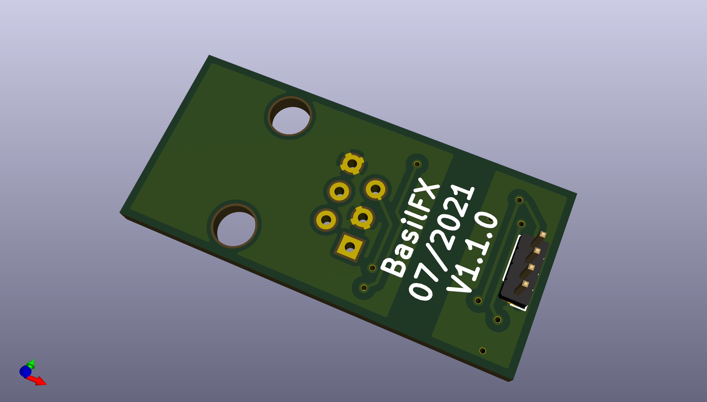
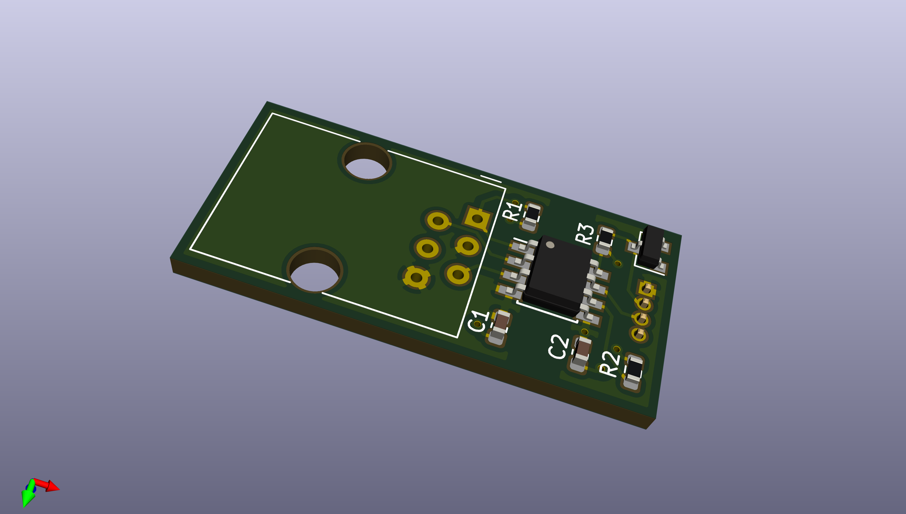

# DSMR-Connector

## Introduction
This board converts the P1 port found on Dutch Smart Energy Meters to UART, opto-isolated from the Taster module. You can find more information in the [P1 Companion Standard](https://www.netbeheernederland.nl/_upload/Files/Slimme_meter_15_a727fce1f1.pdf).

This board is only compatible with DSMR 5.0, since that version is using two additional pins (therefore RJ-12 instead of RJ-11) to supply the bidirectional optocoupler.

## Pictures

## Schema
You can find the schema [here](DSMR-Connector.pdf).

## BOM
| **Ref** | **Value**     | **Footprint**                                          | **Farnell** | **DigiKey**         | **Notes**         |
|---------|---------------|--------------------------------------------------------|-------------|---------------------|-------------------|
| C1      | 100nF         | Capacitor_SMD:C_0603_1608Metric                        | 1833843     |                     |                   |
| C2      | 100nF         | Capacitor_SMD:C_0603_1608Metric                        | 1833843     |                     |                   |
| J1      |               | Connector_RJ:RJ12_Amphenol_54601                       | 2135977     |                     |                   |
| J2      |               | Connector_PinHeader_1.27mm:PinHeader_1x04_P1.27mm      |             |                     |                   |
| Q1      | BC847         | Package_TO_SOT_SMD:SOT-23                              | 2533307     |                     | General purpose   |
| R1      | 10K           | Resistor_SMD:R_0603_1608Metric                         | 2447230     |                     |                   |
| R2      | 10K           | Resistor_SMD:R_0603_1608Metric                         | 2447230     |                     |                   |
| R3      | 10K           | Resistor_SMD:R_0603_1608Metric                         | 2447230     |                     |                   |
| U1      |               | Package_SO:SOIC-8_3.9x4.9mm_P1.27mm                    |             | FOD8012A-ND         |                   |
