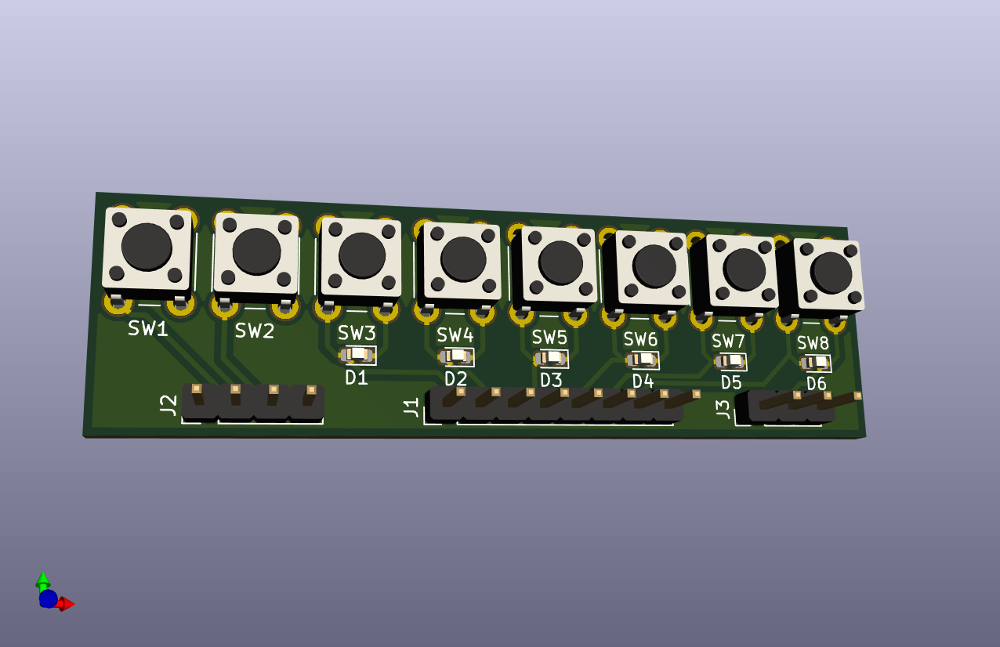

# Interface Tester

## Introduction
This is an interface tester for the taster board. It is used for verification purposes

## Pictures

## Schema
You can find the schema [here](Interface-Tester.pdf).

## BoM
The (interactive) BoM can be found [here](https://basilfx.github.io/KNX-Universal-Taster/pcb/Interface-Tester/BoM/ibom.html).
