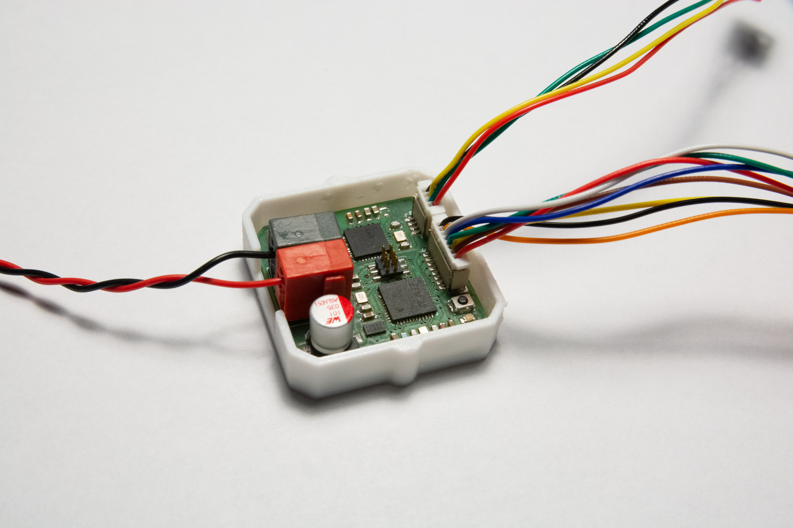
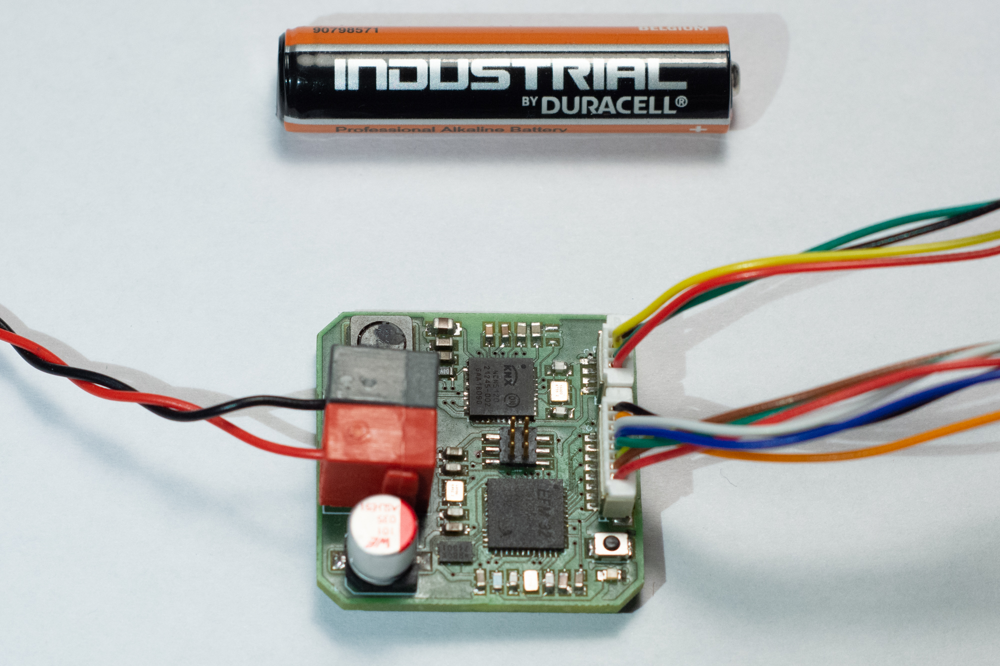
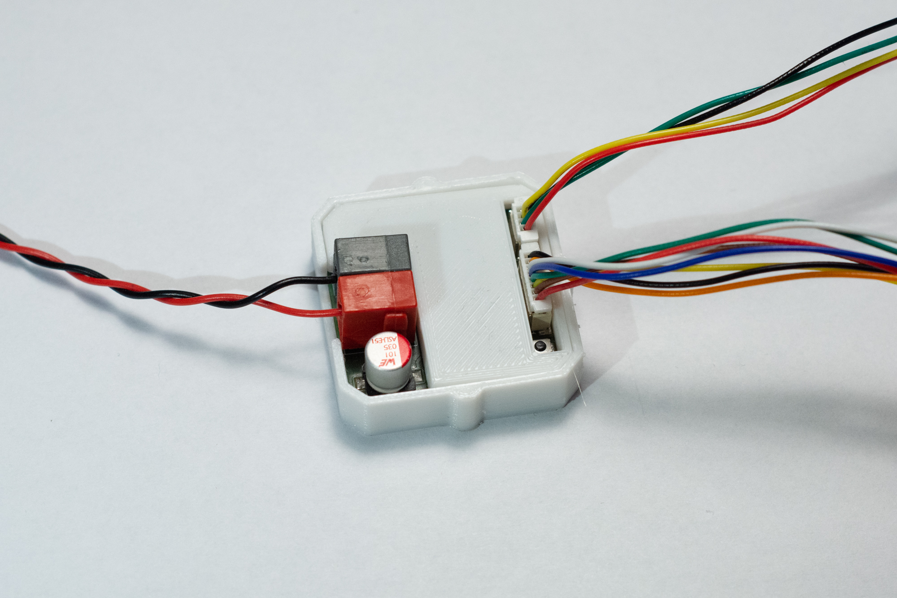
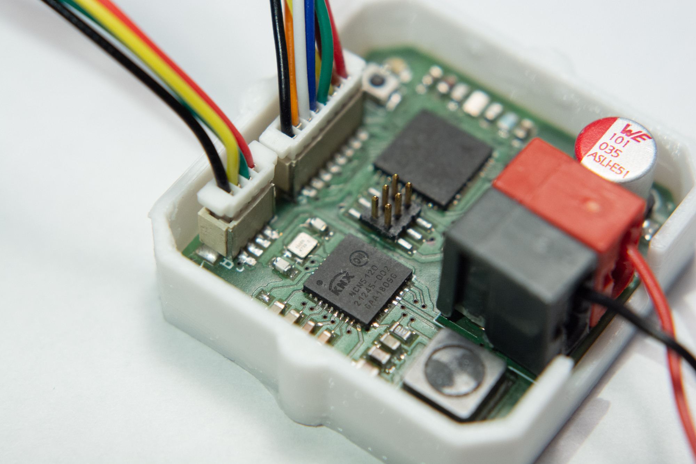
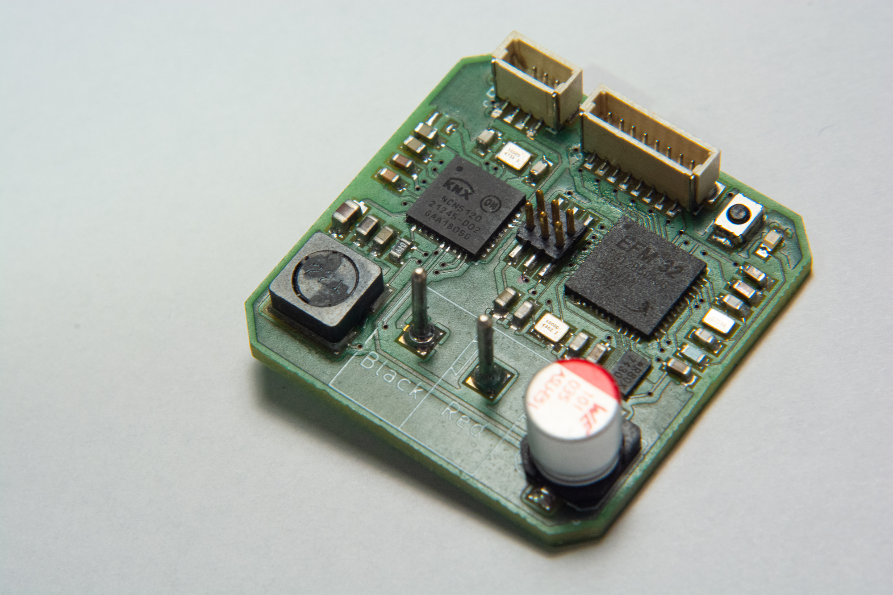
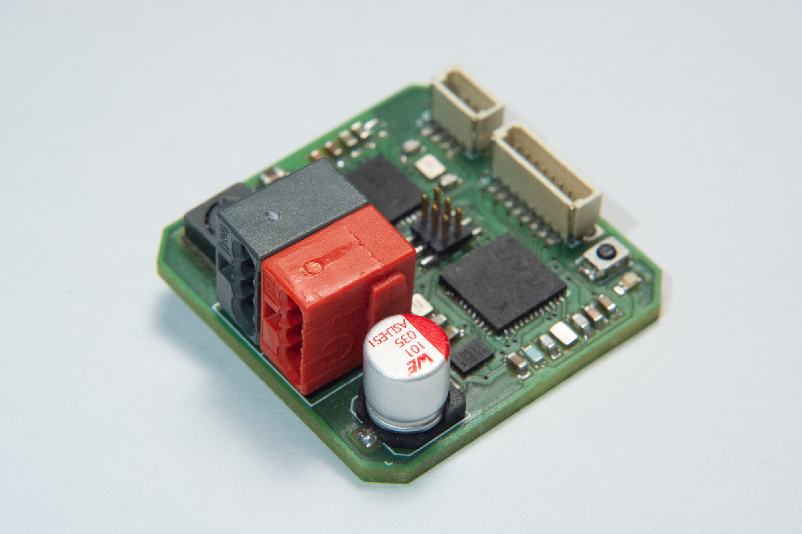

# Universal Taster

## Features
* ARM Cortex M4 CPU with 1 MiB of flash and 256 KiB of RAM
* Compatible with OnSemi NCN5120 and NCN5121
* 8 Mbit SPI NOR flash
* 6 universal GPIO pins
* 2 pins for I2C
* 2 RX/TX pins (without header)
* 30x30x15 mm footprint (including connector)

## Pictures

## Board

## Schema
You can find the schema [here](Universal-Taster.pdf).

## Compatibility
This board is compatible with the [OnSemi NCN5121](http://www.onsemi.com/pub/Collateral/NCN5121-D.PDF)
or the [OnSemi NCN5120](http://www.onsemi.com/pub/Collateral/NCN5120-D.PDF).

## BoM
The (interactive) BoM can be found [here](https://basilfx.github.io/KNX-Universal-Taster/pcb/Universal-Taster/BoM/ibom.html).
